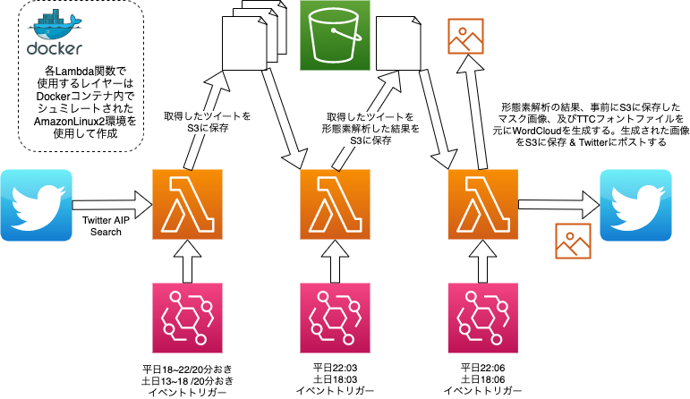

Word Cloud 自動生成 Twitter-Bot
====

<br />

# 構成図


<br />

# 環境

```
aws --version
aws-cli/2.1.27

docker --version
Docker version 20.10.5
```

<br />

# Usage

1. 以下名前のLambda関数を3つ作成 (Python3.8)
- baseballCollectTweets
- baseballJanome
- baseballCreateWordCloud

<br>

2. dockerを使用して、Lambda関数に必要なライブラリがインポートされたLambda Layersを登録する。

<br />
※ 以下はCollectTweetsの例

```
$ git clone git@github.com:spider-man-tm/baseball-twitter-bot.git
$ cd baseball-twitter-bot/baseballCollectTweets/layers


# AWS公式のAWSサーバーレスアプリケーションモデル(SAM)を利用
$ docker run -v "$PWD":/var/task "public.ecr.aws/sam/build-python3.8" /bin/sh -c "pip install -r requirements.txt -t python/lib/python3.8/site-packages/; exit"


# インストールされたモジュール群を圧縮
# ファイル名は任意
$ zip -r mypythonlibs.zip python > /dev/null


# 上記で作成されたzipファイルを元に新規Lambda Layers作成
# レイヤー名は任意
$ aws lambda publish-layer-version --layer-name baseballCollectTweets --description "My python libs" --zip-file fileb://mypythonlibs.zip --compatible-runtimes "python3.8"


# 作成されたLambda Layersを空のLambda関数に追加
# Lambda LayersのARNは先ほど作成したlayerのARNを指定
$ aws lambda update-function-configuration --layers arn:aws:lambda:ap-northeast-1:xxxxxxxxxxxx:layer:baseballCollectTweetss:1 --function-name baseballCollectTweets
```

<br />

3. `upload-function.sh` を実行し、3つのLambda関数にそれぞれローカルのコードをアップロードする。

```
$ sh upload-function.sh
```

<br />

4. 3つのLambda関数それぞれにトリガーとなるCloudWatch Eventsを設定します。

<br />
※ 以下は設定するcron式（平日用のみ掲載、休日用には別途時間帯で作成）<br />
※ UTFとJSTの時差を考慮して設定することに注意<br />

| 関数名 | cron | 内容 |
| -- | -- | -- |
| baseballCollectTweets | cron(0/20 9-14 ? * MON-FRI *) | 平日18-23まで20分おきに実行 |
| baseballJanome | cron(3 14 ? * MON-FRI *) | 平日23:03に実行 |
| baseballCreateWordCloud | cron(6 14 ? * MON-FRI *) | 平日23:06に実行 |
